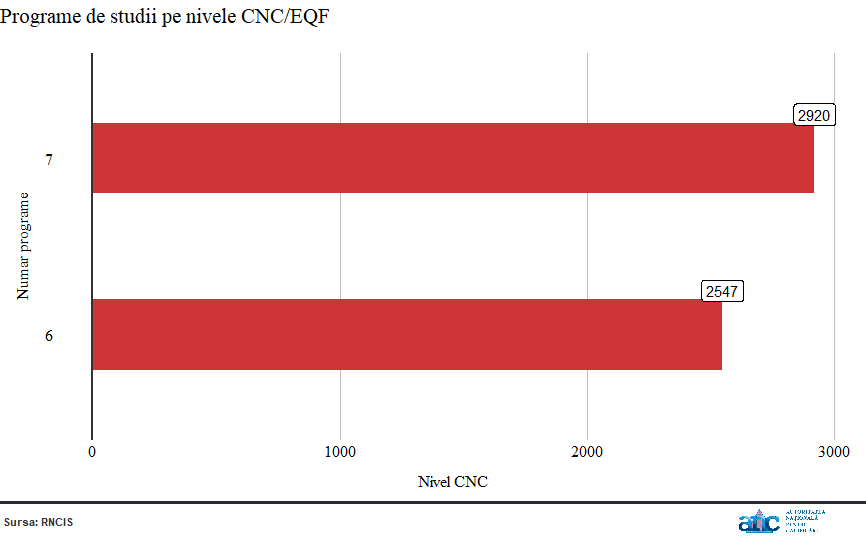

Log: Today I used R for data wrangling and visualisation using the R packages `tidyverse, rmarkdown and echarts4r.`

## **Data visualisation**

**Function to align left the text of ggplot title and subtitle**

```r
#left text
text_left<-function(plot)
{
  g<-ggplotGrob(plot)
  idx<-which(g$layout$name=="title")
  idx2<-which(g$layout$name=="subtitle")
  g$layout$l[idx]<-2
  g$layout$l[idx2]<-2
  grid.newpage()
  grid.draw(g)
  return(g)
}
```


**Function to add logo and caption bellow ggplot**

```r
add_footer<-function(sursa,logo)
{
  footer<-grobTree(#rectGrob(gp=gpar(fill="white",col=NA)),
    linesGrob(unit(c(0, 1), "npc"),unit(1.05, "npc"),gp = gpar(col = '#282A36', lwd = 3)),
    #rectGrob(x=unit(0.05, "npc"), y=unit(18.4, "npc"),height = unit(1.5,"cm"),width=unit(0.01,"npc"),gp=gpar(fill="#CF3536",col="#723843")),
    textGrob(sursa,x = 0.004,unit(0.5, "npc"),hjust=0,gp=gpar(col="gray20",fontsize=8,fontface="bold")),
    # textGrob("Surs\U0103: Eurostat",x=.78,hjust=-1.06,unit(1.6, "npc"),gp=gpar(col="gray20",fontface="bold",fontsize=8)),
    rasterGrob(logo, x = 0.850, hjust=0))
  return (footer)
}
```

**Function to add custom theme to ggplot**

```r
custom_theme<-function(legend_p)
{
    theme(plot.subtitle = element_text(color="gray30",family = "serif", face="italic",size=16,margin=unit(c(0,0,0,0),units="mm")),
          plot.title = element_text(family = "serif",size=16,margin=unit(c(2,0,2,0),units="mm")),
          legend.title = element_blank(),
          plot.margin = unit(c(0,4,0,0), units = "mm"),
          legend.text = element_text(family = "serif", color = "black",size=10),
          axis.text.x = element_text(family = "serif",color="black",size=12,margin=unit(c(0,0,0,0),units="mm")),
          axis.text.y=element_text(family = "serif",color="black",size=12,margin=unit(c(0,0,0,0),units="mm")),
          axis.title.x = element_text(family = "serif", color = "black",size=12,margin=unit(c(4,4,4,4),units="mm")),
          axis.title.y = element_text(family = "serif", color="black",size=12,margin=unit(c(4,4,4,4),units="mm")),
          plot.background = element_blank(),
          panel.background = element_rect(fill="#ffffff"),
          legend.background = element_rect(color="white", fill="white"),
          panel.grid.minor.y = element_blank(),
          panel.grid.major.y = element_blank(),
          panel.grid.minor.x = element_blank(),
          panel.grid.major.x = element_line(color = "#bfbfbf"),
          axis.ticks=element_blank(),
          plot.caption = element_text(face="bold",color="gray20"),
          legend.position = legend_p,
          strip.background = element_rect( fill="white", linetype="solid"),
          strip.text =element_text(face=c("italic","bold"),size = 7))
}
```


## **Data wrangling**


```r
# filter dataframe with by specific condition
count_by_cnc<-filter(RNCIS,RNCIS$Status=="Inregistrat"|RNCIS$Status=="Validat",is.na(RNCIS$Arhivat))
# count values in column A by column B
count_by_cnc<-count(count_by_cnc,count_by_cnc$`Nivel CNC`)
# replace column names for easier use
names(count_by_cnc)<-c("CNC", "Distributie")
# transform column A data as factor 
count_by_cnc[,1]<-as.factor(count_by_cnc$CNC)
# plot code
p<-ggplot(count_by_cnc, aes(x=as.factor(CNC), y=Distributie)) + 
# to create bar type plot
  geom_bar(stat = "identity",position = "identity",fill="#CF3536", width = 0.4) +
# add line at the bottom of distribution
  geom_hline(yintercept = 0, size = 1, colour="#333333") +
  labs(title = "", subtitle = "")+
# add labels
  geom_label(label=count_by_cnc$Distributie, nudge_x = 0.25, nudge_y = 0.25)+
# add the theme
  custom_theme(legend_p = "none")+
# custom title and axes title
  labs(title="Programe de studii pe nivele CNC/EQF",x="Numar programe",y="Nivel CNC",)+
 # flip coords for better aesthetics
coord_flip()
# align the text left
final_plot<-text_left(p)
# add custom logo and caption
final_plot <- grid.arrange(final_plot,add_footer("Sursa: RNCIS",img2),heights=c(9,0.6))

```


